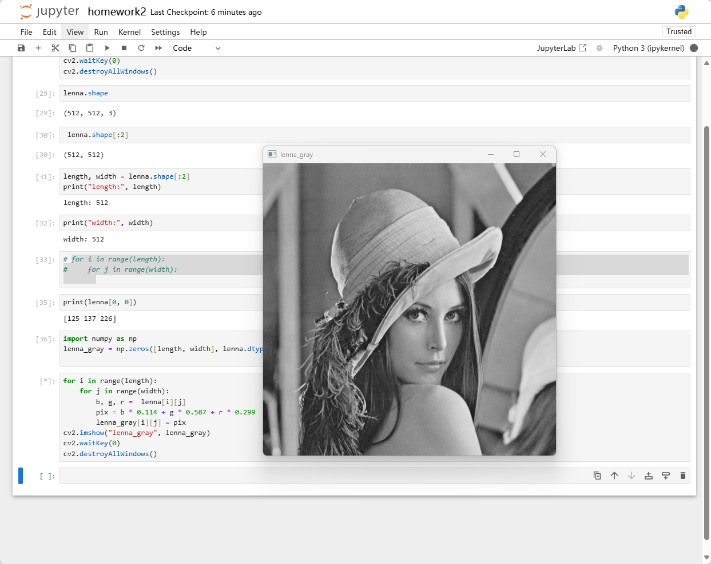

## 灰度化
代码如下:  
```
import cv2
import numpy as np
# 读取lenna.png
lenna = cv2.imread('./lenna.png')
# 获取图片的宽高数据
length, width = lenna.shape[ : 2]
# 创建一个同等宽高的图片
lenna_gray = np.zerosp([length, width], lenna.dtype)
# 通过双层for循环将原图像素数据处理后放入lenna_gray中
for i in range(length):
    for j in range(width):
        b, g, r = lenna[i][j]
        lenna_gray[i][j] = b * 0.114 + g * 0.587 + r * 0.299
cv2.imshow("lenna_gray", lenna_gray)
# 保存图像到当前目录
cv2.imwrite('./lenna_gray.png', lenna_gray)
cv2.waitKey(0)
cv2.destroyAllWindows()
```
结果如下：  

